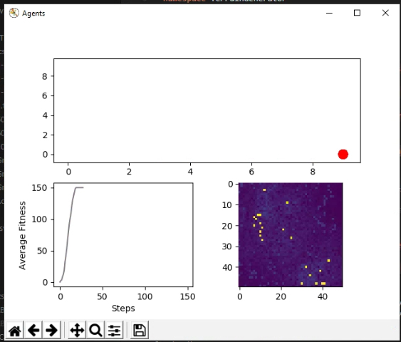
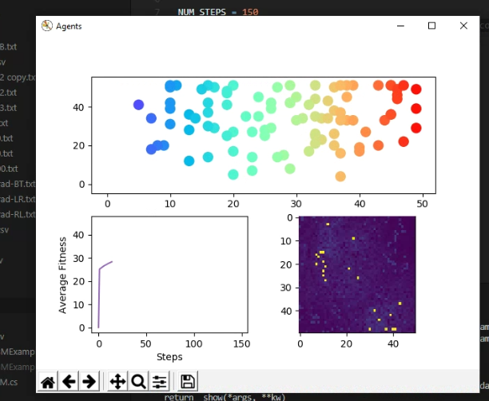
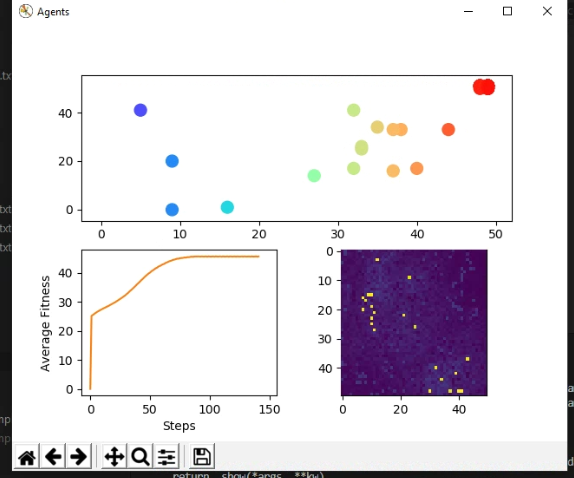

# MarsCognitiveABM
A library for creating large scale Cognitive Agent Based Models using Mars.Life.Simulations

MARS Group:
https://mars-group.org/

MARS NuGet Package:
https://www.nuget.org/packages/Mars.Life.Simulations/

## Code overview

There are 3 root folders to the project, but the core of the code is in `CognitiveABM` and `Examples`.

### Root folders:

`CognitiveABM` the abstract CognitiveABM library, an abstraction of the interfaces and classes used to create our cognitive ABM proof of concept to make creating similar but more complex uses easier to implement.

`Examples/HillClimberABMExample` example showing usage of the CognitiveABM library and approach.

`TerrainGenerator` tool for generating CSV files for use in the HillClimberABMExample.

### CognitiveABM architecture

ABM - manages the execution of the ABM.

FCM - manages reproduction between generations

Perceptron - uses an agent's genomes as values in a perceptron matrix and is used to make decisions.

QLearning - the newest and most experimental module of code, I would visit this first if I was going to redo/verify a section of code. We implemented this last and it has given Daniel a lot of trouble. Go to Daniel Borg for questions about this code.

### What needs re-coding

#### Essential:

The QLearning module we had working for a short while, but it's currently not in use (would be used in `Animal.cs`), but Daniel has been having some issues with the data structure as of late. Just needs to be cleaned up and some index out of bounds errors removed.

#### Desired:

The slowest part of each iteration is running the simulation of the agents itself, and I think this is caused by the amount of math and calculations that is done each step when agents use the perceptron to decide where to move. Optimizing the perceptron (`Perceptron.cs`) math would greatly increase performance. 

## Useful Additions

A visualization tool that could include the decision making process for a single agent would be a great way of debugging the perceptron and/or the q-learning model. As of now the visualization tool is currently built specific to the hill climber example. In the future it would be best to make an implementation agnostic visualization tool. Potentially library implementers could extend the base tool to make more implementation specific animations and visualizations.

## Building and running application

If you use VS Code you install the official C# extension, and then you can simply hit `F5` and it will run the example with the following launch configuration: 

```json
{
    "name": ".NET Core Launch (console)",
    "type": "coreclr",
    "request": "launch",
    "preLaunchTask": "build",
    // If you have changed target frameworks, make sure to update the program path.
    "program": "${workspaceFolder}/Examples/HillClimberABMExample/bin/Debug/netcoreapp2.1/HillClimberABMExample.dll",
    "args": ["-sm config.json"],
    "cwd": "${workspaceFolder}/Examples/HillClimberABMExample",
    // For more information about the 'console' field, see https://aka.ms/VSCode-CS-LaunchJson-Console
    "console": "internalConsole",
    "stopAtEntry": false,
    "logging": {
        "moduleLoad": false
    }
}
```

Output into the console should look like:


`Examples/HillClimberABMExample/config.json` is where you can configure MARS specific parameters like number of agents, number of steps, layers, and terrains.

If you're not using VS Code you can run the example from the command line with `.NET Core 2.1` like so:

From within the `Examples\HillClimberABMExample` directory run `dotnet run -sm config.json`

### Visualization tool

We have written a small but helpful visualization tool with `Python3` and `matplotlib`. The source is located in `Examples/HillClimberABMExample/animate.py`.

It reads data from `Animal.csv` and displays the positions of the agents at each step of the simulation frame by frame.

The top plot is the position of the agent relative to the terrain. Bottom left is the average agent fitness over steps. Bottom right is a top-down topographical view of the terrain layer. 

#### Setup and running

Assuming the data has properly been outputted into `Animal.csv` from a training or test run of the ABM, you can simply run `python animate.py`.

Make sure to properly setup your Python environment for the following dependencies (should be straightforward):

`numpy, matplotlib, csv, Camera`

```python
import numpy as np
from matplotlib import cm
import matplotlib.pyplot as plt
import csv
from celluloid import Camera
```

#### Example images

A finished basically perfect ABM run, all agents have gone to the same spot (red dot) on the terrain.



Here is when the animation has just started, you can see all the agents (top plot) are spread out.



In progress ABM run where the agents are not all perfect, but most are doing well.



